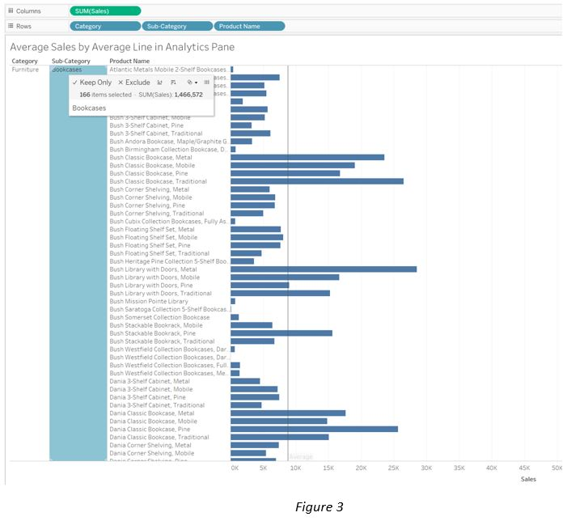

With Tableau Level of details expression, the view can have different level of aggregations that are not at the level of the visualization. This repos illustrates this concept. Often times, in different business scenarios, we need to view product sales and/or product average sales at the different level of details to get the insights, the example also explains what it means and how to achieve it using Tableau average line in the Analytics Pane and Tableau calculations. 

* The dataset used in the example is the Global Super Store excle file. File download can be found at the below Tableau community link:

  https://community.tableau.com/s/question/0D54T00000C5vSDSAZ/global-superstore-data-file?t=1595530793707

* Figure1 shows the view of Category, Sub-Category, Product Name and Sum of Sales.

  When pulling in the Average Line from the Tableau Analytics Pane to the Pane Level for average line for each Category and Sub-Category, the   Average sales of Bookcases is 8835.

 * What if one likes to view the Sub-Categories on one page without having the product name in the view? Figure 2 shows Average sales for      Bookcases is a much smaller amount 603.8. So, what happened? How does Tableau calculate the Averages?

 Let’s first understand how Tableau calculates the Average in Figure 1. Hovering mouse over Sub-Category Bookcases,  the view shows total of   166 items of Product Name in the Sub-category Bookcases and sum of sales for the Bookcases sub-category is 1,466,572. Tableau divides   product sales by the sum of Bookcases sales, which is the average sales of 8835, It is illustrated in Figure3.

* How does Tableau calculate the average sales of 603.8 on Bookcases Sub-Category shown in Figure2 ?

  Tableau calculates the average sales of Bookcases category as:
  Average Sales2 = SUM([Sales])/COUNT([Orders])  

* Put the Average Sale2 and original Average Sales shown in the Figure2 side by side in the cross tab view in Figure4, it proves how Tableau   performs its average sales calculation by Category and sub-category.

* Back to the LOD, to have the view of detailed level of aggregation (average product sales) without the product name in the view, we need a   FIXED LOD. 
  Fixed_Sales_by_Product_Name={FIXED [Product Name]:SUM([Sales])}   

  When pulling calculated field Fixed_Sales_by_Product_Name into the view shelf, have it side by side with the average sales (Average Sales),   the FIXED LOD Average sales of 8835, shown in Figure5, it is the same as the average line in Figure1, which has Level of Details Product   name in the view.  

  With the FIXED LOD, the view is showing average of Product Name without the Product Name in the view. This is one of the use cases of FIXED   LOD.